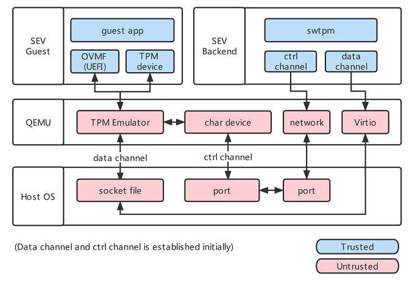

## Motivation

Trusted platform module (TPM) is used in various sensitive crypto scenes, such as key management and measurement.
A guest virtual machine (VM) in the cloud may rely on a virtual trusted platform module (vTPM) for security purposes such as boot integrity measurement.

The mounting concerns about privacy call for the exclusion of cloud providers from the trusted computing base in cloud computing.
In traditional solutions, vTPM instances are created and maintained by the cloud provider in existing solutions.
It can be seen that user may question the integrity and confidentiality of the TPM services provided by the cloud.

We seek to design a framework <u>provisioning trusted vTPM for VMs in the cloud in confidential cloud computing scenarios</u>.

## Approaches

To protect VM from the potentially malicious hypervisor, we adopt [AMD SEV-SNP](https://www.amd.com/en/developer/sev.html), which helps guarantee the integrity and confidentiality of VM on the basis of trust to AMD's Secure Processor (SP).

The key is to
1. protect vTPM from hypervisor by hosting it in a confidential backend VM
2. establish a trusted connection between the guest VM and the backend VM
3. enable the guest VM to attest to the vTPM instance and the backend VM

<figure>

<figcaption>CvTPM Architecture Overview</figcaption>
</figure>

To secure the connection traveling through the untrusted hypervisor, I proposed to apply encryption on the channel, verified the solution’s viability by inspecting the implementation of involved drivers and hypervisors (qemu), and designed a protocol that transmits encrypted commands while being compatible with traditional TPM interfaces.

In addition, I expanded our considerations of TPM users to cover usages in UEFI, extending the project scope to offer trusted measured boot.
Measured boot is a complicated process which involves interactions between cloud hypervisor, cloud user, and AMD.
I am utilizing the available APIs to establish the local attestaion between the guest VM and the backend VM.

The project is still in progress.
I am in charge of most development in UEFI and Linux kernel to support encryption protocol and attestation protocols in the TPM channel.

